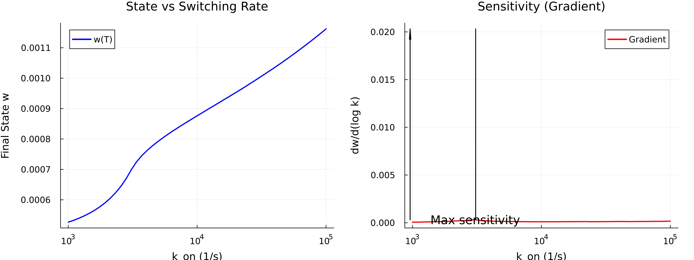
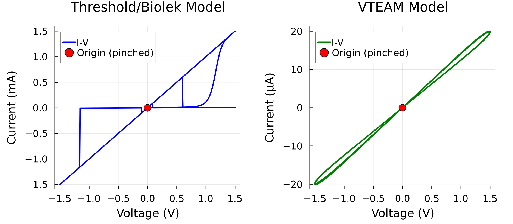
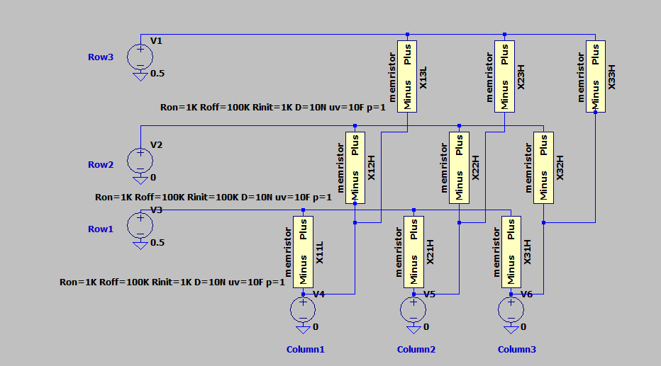
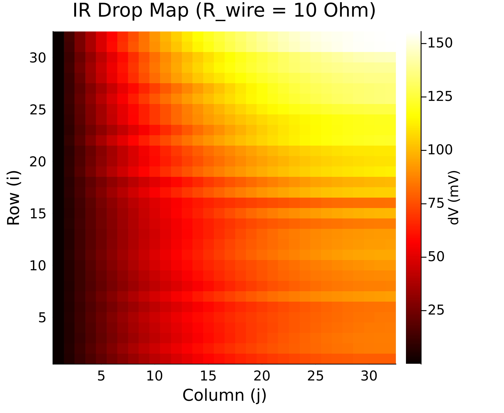
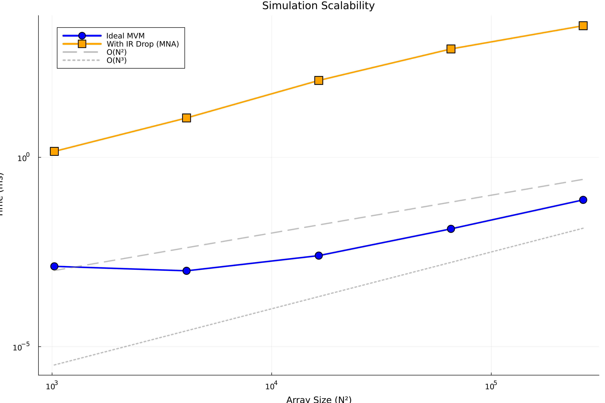

# Memristive Computing: Device Physics, Crossbar Architectures, and Scalable Simulation

[](memristor-sota.pdf)

Repository for the paper **"Memristive Computing: Device Physics, Crossbar Architectures, and Scalable Simulation"**. 
This project provides a comprehensive analysis of memristors, resistive switching, and their application to neuromorphic computing and in-memory computation, accompanied by both a lightweight pure-Julia simulation framework and integration with the high-performance Xyce simulator.

---

## 📖 The Paper

The full document explores:
- **Theoretical Foundations**: The "fourth circuit element" proposed by Leon Chua and the HP Labs physical realization.
- **Resistive Switching Physics**: ECM/VCM mechanisms and bipolar vs. unipolar switching behaviors.
- **Crossbar Architectures**: Matrix-Vector Multiplication (MVM) engines, comparing Passive 0T1R and Active 1T1R arrays.  
- **Circuit Simulation & Modeling**: Device nonlinearity tradeoffs and Non-idealities such as IR Drop formulations and Read Noise.
- **Large-Scale Simulation Framework**: Introducing custom-built Julia packages mapping abstract memristive models to robust Spice engines.

## Repository Structure

The source code, papers, and simulation examples are organized as follows:

```
memristor-sota/
├── memristor-sota.qmd       # Main paper source (Quarto/LaTeX)
├── figures/                 # Images and plots generated for the paper
├── MemristorODE/
├── XyceSim/
├── mmrstor_biolek/          # Xyce Biolek validation modules
└── memris-research/         # Legacy LTSpice simulation files and early WIP
```

## Simulation Frameworks

This repository introduces a unified codebase for advanced scalable memristor simulation, written natively in Julia:

### 1. `MemristorODE` (Pure Julia)
A lightweight standalone ODE-based memristor simulation package supporting **Threshold** and industry-standard **VTEAM** models. It models device parameters explicitly without needing external circuit simulators.

- **Matrix Vector Multiplications**
- **IR Drop Analysis**: Utilizes Sparse Modified Nodal Analysis (MNA) to trace voltage degradation natively across arrays.
- **ForwardDiff.jl Integration**: Demonstrates differentiable programming to extract gradients—the fundamental step toward Hardware-Aware Neural Network Training directly on memristor physics limits.




```julia
using MemristorODE

# Build array & Define inputs
xbar = CrossbarArray(32, 32, R_on=1e3, R_off=100e3)
V_in = rand(32)

# MNA IR drop simulation
I_out = simulate_crossbar_mvm_with_ir(xbar, V_in) 
```

### 2. `XyceSim` (Parallel Xyce Wrapper)
A high-performance scalable wrapper that bridges analytical Julia layouts with **Sandia National Labs' open-source Xyce simulator** using `Jyce`.

- Enables extreme-scale crossbar netlist generation via the ADMS memristor plugins.
- Allows rigorous validation of abstract threshold models against industry-level SPICE engines.

```julia
using XyceSim

sim = XyceSim.create_simulator()
xbar = XyceSim.create_crossbar_array(32, 32)
results = XyceSim.run_and_plot_crossbar(sim, xbar)
```

## Key Results

### Architecture Comparisons
Using LTSpice formulations mapping passive (0T1R) against active selections (1T1R) which reduce sneak-path currents drastically while raising footprint sizes.



### Scalability bounds & IR Drop Array Distortions
Wire resistance poses significant voltage attention in larger arrays (the "IR drop" problem). Mapping the voltage node degradation isolates scaling limits for reliable neuromorphic edge inferencing.



Simulation timings benchmarked for crossbar arrays demonstrate the efficiency of our pure-Julia IR analytical approach against traditional formulations:



## Getting Started

Ensure you have **Julia 1.11+** installed alongside Python frameworks if extracting metric plots externally.

To set up either simulation package locally via Julia REPL Pkg mode:

```bash
# Clone the repository
git clone https://github.com/MadeByDaris/memristor-sota.git
cd memristor-sota

# Add the pure Julia Memristor engine
julia -e 'using Pkg; Pkg.develop(path="MemristorODE")'

# Add the Xyce wrapper (requires Jyce package and Xyce binaries)
julia -e 'using Pkg; Pkg.develop(path="XyceSim")'
```

For executing GUI-based SPICE models directly, the `memris-research/spice` folder contains localized Biolek model `.sub` implementations and `memristor.asy` schematic symbols for **LTSpice**.

## Key References

- L. Chua (1971). "Memristor—The missing circuit element." *IEEE Trans. Circuit Theory*
- D. Strukov, et al. (2008). "The missing memristor found." *Nature*
- Z. Biolek, et al. (2009). "SPICE model of memristor with nonlinear dopant drift"
- S. Kvatinsky, et al. (2015). "VTEAM: A general model for voltage-controlled memristors." 

*(For a more thorough reading list, refer directly to `bibliography.bib` and the references index in the paper).*

---

**Daris Idirene** — Université Paris-Saclay  
*Faculty of Sciences - E3A Program*
